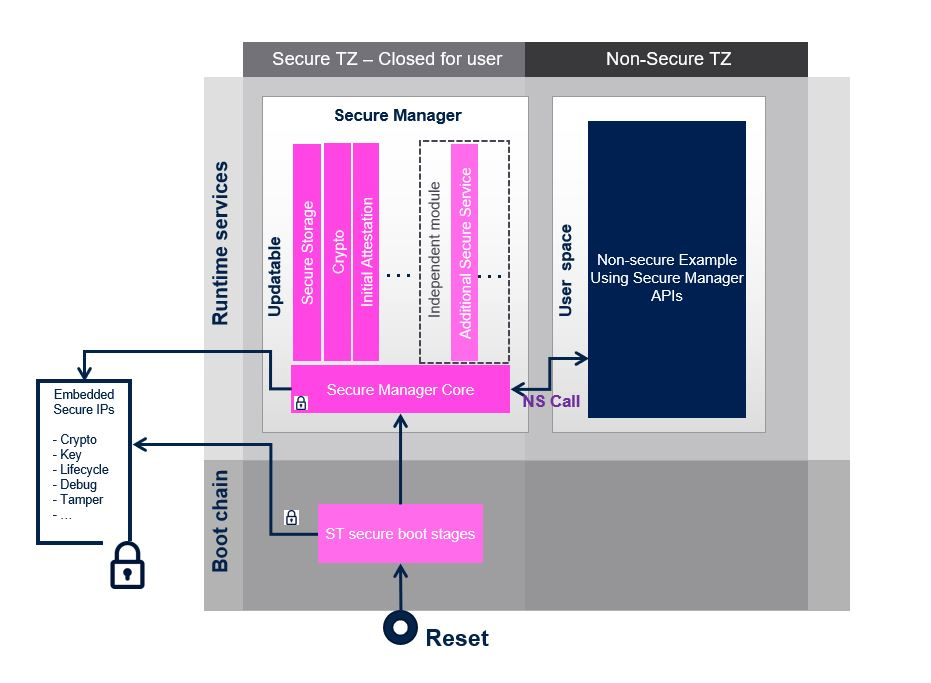

::: {.row}
::: {.col-sm-12 .col-lg-4}

# Release Notes for Secure Manager API Middleware
Copyright &copy; 2023 STMicroelectronics\

{.logo}

# Purpose

The Secure Manager API Middleware enables **ST Installable Services** that provides callable standard PSA Services API for Non secure application at run time.

The supported Secure Services are :

- Internal Trusted Storage

- Cryptography, with AES, ECC, RSA, SHA, TRNG

- Initial attestation

- Firmware Update

Non secure applications can access these Secure Services using the interfaces delivered in the Secure Manager API middleware.
:::

::: {.col-sm-12 .col-lg-8}
# Update history

::: {.collapse}
<input type="checkbox" id="collapse-section3" checked aria-hidden="true">
<label for="collapse-section3" checked aria-hidden="true">__V2.1.0 / 11-August-2023__</label>

## Main Changes

- FWU : Rename PSA_FWU_TYPE_ID_xx to FWU_IMAGE_TYPE_xx
- Crypto : Update the function randomize_buffer
- ITS : psa_its_get returns PSA_SUCCESS when the data length is NULL
- Remove unnecessary APIs

## Known Limitations

- None

## Backward Compatibility

- Break of compatibility with SMAK_Appli of STM32CubeH5 Firmware Package V1.0.0.

## Dependencies

- Secure Manager binary have to be programmed on STM32 devices to enable PSA services. Please download package on [STM32TRUSTEE-SM](https://www.st.com/en/embedded-software/stm32trustee-sm.html).

::: {.collapse}
<input type="checkbox" id="collapse-section2" aria-hidden="true">
<label for="collapse-section2" checked aria-hidden="true">__V2.0.0 / 30-May-2023__</label>

## Main Changes

- Implementation of lock mechanism in psa api
- MISRA compliance
- Update of the middleware file tree

## Known Limitations

- psa_sign_hash() is not compatible with mutex implementation through ns_ipc_seq_begin()

## Backward Compatibility

- Break of compatibility with SMAK_Appli of STM32CubeH5 Firmware Package V1.0.0.

## Dependencies

- Secure Manager binary have to be programmed on STM32 devices to enable PSA services. Please download package on [STM32TRUSTEE-SM](https://www.st.com/en/embedded-software/stm32trustee-sm.html).

<input type="checkbox" id="collapse-section1" aria-hidden="true">
<label for="collapse-section1" checked aria-hidden="true">__V1.0.0 / 08-February-2023__</label>

## Main Changes

First official release of Secure Manager API Middleware.

Secure Manager API compliant with following PSA versions:

- PSA Attestation API 1.0 (ARM IHI 0085)
- PSA Cryptography API 1.0 (ARM IHI 0086)
- PSA Storage API 1.0 (ARM IHI 0087)
- PSA Firmware Update API 0.7 Beta (ARM IHI 0093)

## Known Limitations

- None.

## Backward Compatibility

- None.

## Dependencies

- Secure Manager binary have to be programmed on STM32 devices to enable PSA services. Please download package on [STM32TRUSTEE-SM](https://www.st.com/en/embedded-software/stm32trustee-sm.html).

:::

:::
:::

<footer class="sticky">
::: {.columns}
::: {.column width="100%"}
For complete documentation on **STM32 Microcontrollers** ,
visit: [www.st.com/STM32](http://www.st.com/STM32)
:::
:::
</footer>
